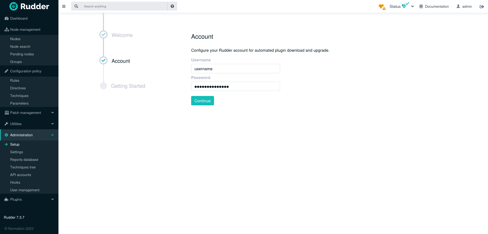

[[plugins-management]]
= Manage plugins

Rudder is an extensible software. The *Plugins*
menu sums-up information about loaded plugins, their version and their
configuration. There are two types of Rudder pre-packaged plugins:

* Integration plugins, that allow linking Rudder to other tools (monitoring, inventory, notification, etc.). They are freely available.
* Advanced features plugins (reporting, validation workflow, etc.) which are part of the Rudder subscription.

You can download free plugins https://repository.rudder.io/plugins/[on repository.rudder.io] or get information about plugins included in the subscription the https://www.rudder.io/software/features/[dedicated page on rudder.io].

== Install plugins with a subscription

First, you need to configure your Rudder technical account (username and password)

Two ways to do it:

- Using the web interface in Administration -> Setup

- Edit the configuration file `/opt/rudder/etc/rudder-pkg/rudder-pkg.conf` where you can also define proxy information if your Rudder server need to get
 through a proxy to download plugins, keep the values empty if you don't need them (no proxy or no authentication).

[source,ini]
----
[Rudder]
url = https://download.rudder.io/plugins
username = USERNAME
password = PASSWORD
proxy_url = 
proxy_user = 
proxy_password =
----

Plugin management uses the `rudder package` command.
Start by updating the repository index and your licenses:

----
rudder package update
----

List available packages:

----
rudder package list --all
----

You can then install plugins with:

----
rudder package install <plugin_name>
rudder package install <plugin_name_1> <plugin_name_2>
----

The application will restart if necessary. Please read install output carefully as some
plugins require additional dependencies.

To update a plugin, refresh repository index with `rudder package update` and run the install
command again.

You will need to update your licenses with `rudder package update` before their expiration.
An alert will appear in Rudder's menu bar when a license is close to expiration.

== Manual plugins installation

Plugin management uses the `rudder package` command.
You need to download the `.rpkg` package file of the plugin on your Rudder server,
then install it with:

----
rudder package install-file <package.rpkg>
----

To update a plugin, you need to reinstall it with the same command, but in the newer version.
If the plugin requires a license, you can enable it by putting your `license.key` and `.license` files under:

----
/opt/rudder/etc/plugins/licenses/
----

== More about plugins

A plugin is an `.rpkg` file (for "Rudder package"), see the xref:reference:plugin_format.adoc[dedicated documentation] for more
information about the format.

You can get information about available plugins with:

----
# List currently installed plugins
rudder package list
# List currently available plugins
rudder package list --all
# List all available versions of a plugin
rudder package search <package_name>
# Display details of a plugin
rudder package show <package_name>
----

You can manage installed plugins with:

----
rudder package plugin enable <plugin>
rudder package plugin disable <plugin>
rudder package remove <package>
----

See all available commands with:

----
rudder package --help
----

