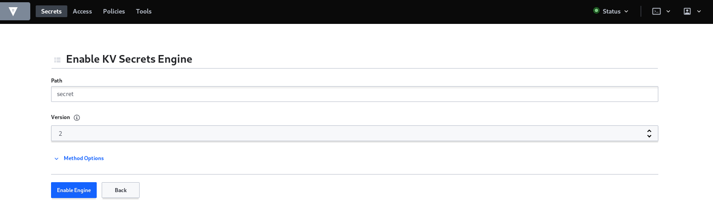
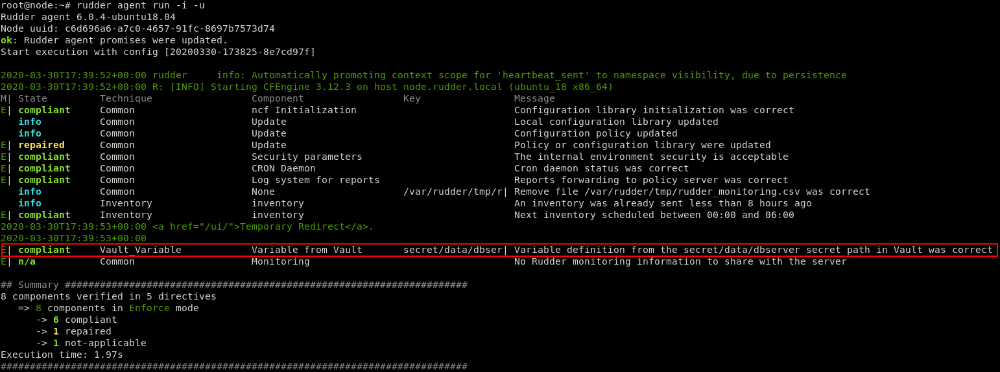

= Configuration policies management in Rudder using Vault plugin

== Introduction
The following documentation will guide you through secrets management process in Rudder generic methods using Vault plugin, we will present a quick introduction for both tools followed by a detailled use case. 
The secrets are initially configured and stored in a Vault server which is a centralized tool that manages and stores them.

== Prerequisites
In our case we will suppose for example, that you have a database server in your infrastructure, configured with credentials, and is linked to a Vault server that allows centralizing such sensitive data.

== Theoretical aspects
Before we go ahead and start introducing a concret example of our use case, we're going to 
present a quick introdcution to Vault and the utility of its integration with Rudder.
Basically, the use of integrating such plugin is to get advantage of a unified use of Vault and Rudder since both tool appear to be complemantary and meet various needs of any organization infrastructre, in terms of compliance, security and configuration management.

=== Introduction to Vault
Vault is a centralized solution that allows you to store or generate secrets for your applications, monitoring who is accessing each secret by exposing a detailed log, generating them on-demand, encrypting and decrypting data and authorizing access based on policies.

It provides in addition different authentication methods that can be either intern such as ‘user/password’, ‘token’ and ‘tls’ or external such as ‘LDAP’, ‘Radius’ and ‘Kubernetes’, also it can be accessible via : API, Web Interface and CLI.

Once Vault is started, it is in a sealed state, it doesn’t allow access to its data. We have to provide it with 3 keys so it can pass to an unsealed state. Those keys are provided by default only during installation.

Vault handle different type of secret engines which are : Generic, Cloud and Infra:

* Generic secrets are used to store secrets in key values format (it can be usernames and passwords), certificates, ssh keys etc.

* Cloud secrets are used to store secrets related to cloud platforms such as AWS, Azure, etc.

* Infra secrets are related for example to databases, cluster secrets, etc.

=== Introduction to Rudder configuration policies

A configuration policy in Rudder is a way, concretely a technique that let you automate and manage your infrastructure, by applying and executing rules directly on your nodes, not only but also supervising them through the audit process.

Using Rudder with Vault offers the opportunity of benefiting from both tools' features in order to ensure compliance and efficient configuration management of your infrastructure.

To exploit configuration policies, you have to create a technique where you can add your generic methods then apply them on your nodes using rules. In the context of our use case, we are going to use Vault plugin via 'Variable from Vault' generic method that will appear among the already existing ones just after the plugin installation. 

== Practical use case

=== Secret definition in Vault

Let’s start by creating a basic key value secret engine to store a database server login information as we mentionned in the prerequisites section above.

We need to specify the path, and the version of the kv secret engine, We may notice that there are two versions for it, the difference between both of them is that version 2 is way more secure than version 1, it provides a way to roll back secrets and recover data.

We need to specify the path, and the version of the kv secret engine, We may notice that there are two versions for it, the difference between both of them is that version 2 is way more secure than version 1, it provides a way to roll back secrets and recover data.

After clicking on ‘Enable Engine’, a unified branch for the engine appears in which we can create as many sections (secrets) as we want.
Now we have to click on ‘Create Secret’ then set the parameters for it, which are basically the path, the number of versions and finally the keys values parameters.

image::SecretDef2.png[Secret Definition 2]

Now let’s go a little bit further. Logically, each secret is related to a set of policies that define who and how we can access it. So, let’s go ahead and create a policy for our secret.

image::SecretDef3.png[Secret Definition 3]

Here, we have defined that the target user can only list all the secrets defined under the path `secret/*`, however, for the dbserver one, he has read and list capabilities. Note that we need to be careful to the order of policy definition, (which is the same for the ACL case definition) otherwise, the policy won’t be valid.

[NOTE]
When creating a secret and defining the path for it, we usually don’t define `/data` in it, it is not visible in the path but we have to put it in order to access data.

[source,json]
----
path "secret/data/dbserver" {
  capabilities = ["read","list"]
}
path "secret/*" {
  capabilities = ["list"]
}
----

image::SecretDef4.png[Secret Definition 4]

Generally, policies must be attached to groups, let’s go ahead and create our group for the policy we just defined.
We have to go to `Access` in the menu above, then click on ‘Create group’, when defining the group parameters, we can choose the type which can be either internal or external, also we’re gonna choose the policy for our group which will be in our case the one we just created.

image::SecretDef5.png[Secret Definition 5]

Now that we have defined our group, We have to create our entity, basically, an entity in Vault is the user or the machine that will access and manipulate the data, but before that, we have to define the authentication methods for our user.
Now we have to click on ‘Enable new method’, in our case we will choose the basic method which is “Username & Password”. Finally we click on ‘Enable Method’.

image::SecretDef6.png[Secret Definition 6]

Now, we finally can create our entity. Let’s put for example, ‘AmyCarr’ as a name and click on ‘Create’.

image::SecretDef7.png[Secret Definition 7]

Now that we have finished creating our user, we need to define the alias for it, an alias as generally known, is simply a representation of the username here, its utility is that we can define different aliases for the same user in order to authenticate for different resources.

We define ‘Amy_C’ as an alias name by clicking on ‘Add alias’, we have to choose also the authentication method that we defined, which is ‘userpass’.

image::SecretDef8.png[Secret Definition 8]

Now, let’s go back to the group section in which we defined our policies, we are going to simply add our entity user to it.
We have to edit our group so we can be able to add ‘Member Entity IDs’ for our user, then we click on ‘Save’.

image::SecretDef9.png[Secret Definition 9]
Now, one only thing left is that we need to define the password for our user, Vault user interface does not support this setup, so we will define it via Vault CLI.

On the Vault CLI we need first to set up the environment variable for the Vault address and the Vault token.

image::SecretDef10.png[Secret Definition 10]

=== Configuration policy defintion in Rudder using Vault plugin

Vault plugin offers a way that makes Rudder Server more adapted to the user ecosystem.
In this context, we are going to demonstrate how we can use the sensetive data stored in Vault server such as the database credentials we have defined above, in the Vault secret definiton section, and as an example, we will recuperate them from Vault server and use them as a Rudder variable which will basically offers a more dynamic way of storing secrets on our Rudder nodes.

In a more advanced step regarding the plugin installation and after configuring our Vault server credentials in the appropriate `vault.json` file, we will be able to create our configuration policy technique and add ‘Variable from Vault’ generic method to it.

image::ConfPolicy1.png[Configuration Policy 1]

The Rudder agent runs automatically every 5 minutes, but to visualize how actually our method is executed, we can run the ‘rudder agent run -i’ command.

Obviously, this method allowed us to fetch a secret from Vault Server, now let’s suppose for example, that we want to store that secret (that contains the login information of a database server) into a credentials file in our node.

To do so, we can simply create another generic method in the same technique called ‘File lines present’ and we have to indicate the file name and the lines we want to insert into the file.

In the lines section we have to call a variable which contains the content of Variable prefix and Variable name of the generic method ‘Variable from Vault’ that are database and userpass. 

image::ConfPolicy3.png[Configuration Policy 3]

To test the method, we can launch the agent on the node and then check the user credentials file, which contains the content of our secret (the username and password of the database user).

image::ConfPolicy4.png[Configuration Policy 4]
image::ConfPolicy5.png[Configuration Policy 5]

== Go Further
Both examples we have introduced, showed a basic use case of Vault secret management and a best practice of how we can fetch those secrets and use them in Rudder configuration policy.

To go further with Vault usage and learn more about Rudder configuration policies, check out the Rudder and Vault official documentation : `https://docs.rudder.io/get-started/current/configuration-policies/technique.html` & `https://www.vaultproject.io/docs/`.

